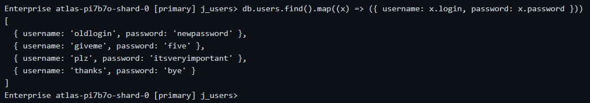

### Тема 3. Управление БД в веб-приложении

Для создания базы данных MongoDB можно использовать MongoDB Cloud.

Подключение к серверу баз данных может производиться с помощью утилиты `mongosh` (MongoDB Shell).

1. Создание базы данных

```
use j_users
```

2. Добавление содержимого

```
db.users.insertMany([{"login":"oldlogin","password":"newpassword"},{"login":"giveme","password":"five"},{"login":"plz","password":"itsveryimportant"},{"login":"thanks","password":"bye"}])
```

3. Получение данных

```
db.users.findOne({login: "oldlogin"}).password
```

4. Подключение с помощью `mongosh`

```
mongosh "mongodb connection string"
```

5. Получение списка всех записей

```
db.users.find().map(x=>({username:x.login, password:x.password}))
```



