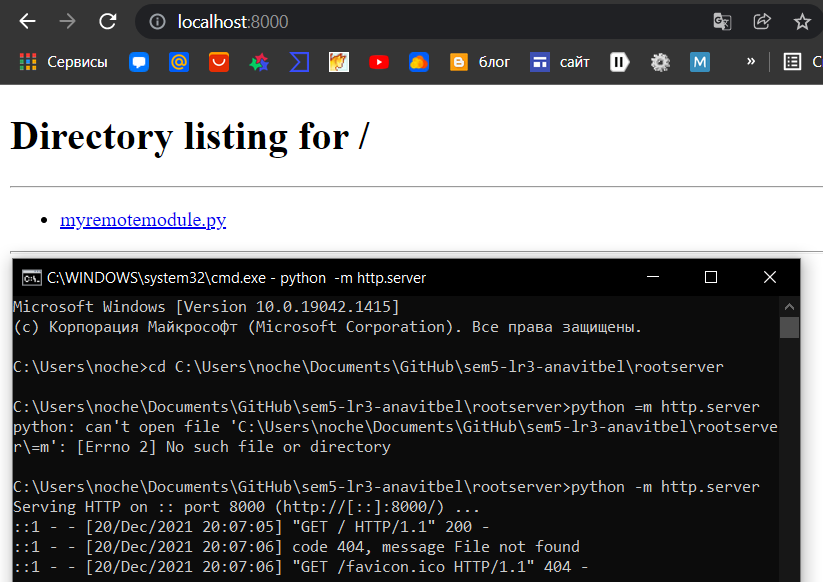

# Лабораторная работа 3. Реализация удаленного импорта

Следуем инструкции из описания лабораторной работы и текста лекции, имеем два файла: `activation_script.py` и в папке rootserver `myremotemodule.py`. С помощью командной строки запускаем сервер, проверяем работу через браузер:

Отлично, всё работает. Не выключая сервер запускаем в новой командной строке наш файл `activation_script.py`. Теперь пробуем импортировать наш модуль без добавления в `sys.path`. Выдаётся ожидаемая ошибка. Теперь всё же добавим наш адрес сервера в `sys.path`, пробуем импортирование ещё раз и запустим функцию из модуля. Ура!

