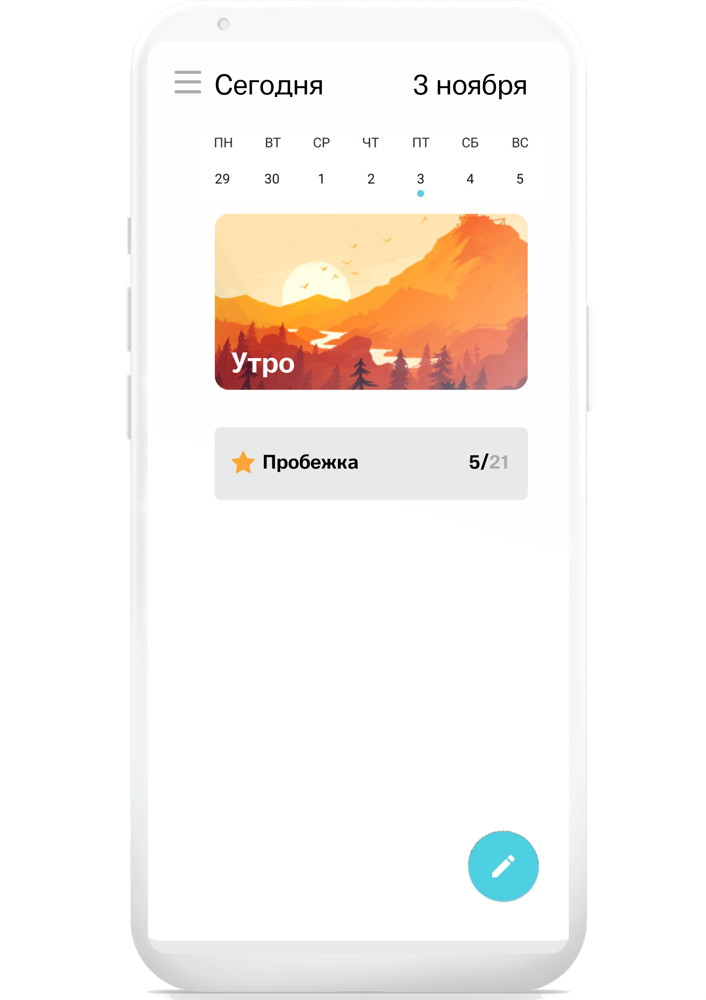
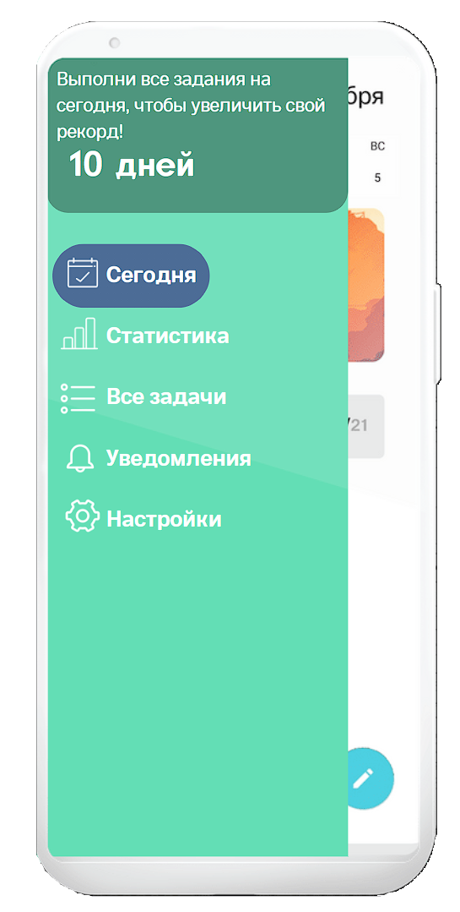
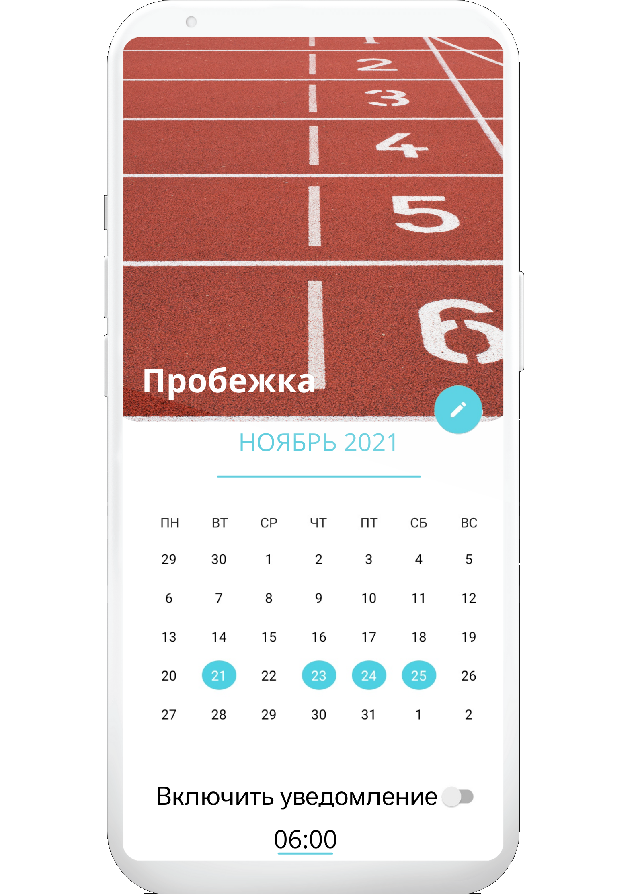

## Лабораторная работа №5 
Задание: создайте прототип (англ. wireframe, layout или mockup) интерфейса проекта, разрабатываемого в рамках курсовой работы. 
Курсовая работа про приложение для трекинга привычек. При создании макетов я использовала Canva, так как там есть много бесплатных изображений и графических элементов.
Макет приветственного экрана:

Макет главного экрана:

Макет меню из главного экрана:

Макет окна при добавлении новой привычки:

